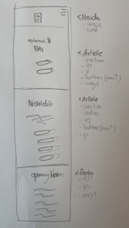
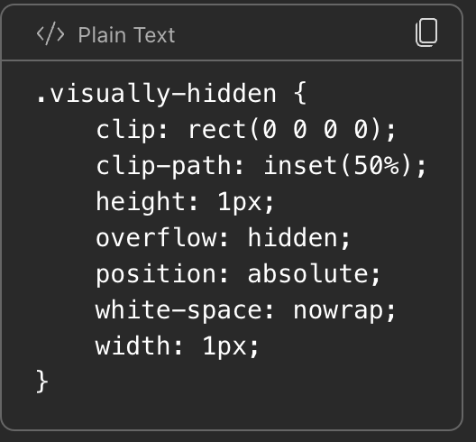
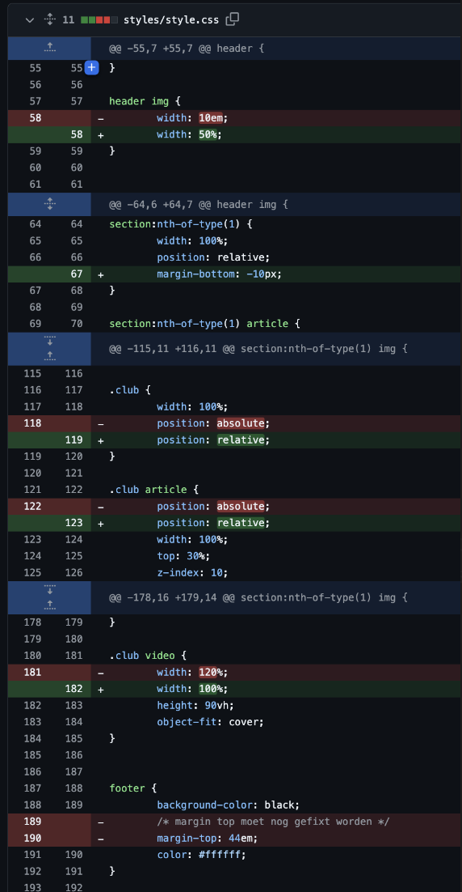

# Procesverslag
Markdown is een simpele manier om HTML te schrijven.  
Markdown cheat cheet: [Hulp bij het schrijven van Markdown](https://github.com/adam-p/markdown-here/wiki/Markdown-Cheatsheet).

Nb. De standaardstructuur en de spartaanse opmaak van de README.md zijn helemaal prima. Het gaat om de inhoud van je procesverslag. Besteedt de tijd voor pracht en praal aan je website.

Nb. Door *open* toe te voegen aan een *details* element kun je deze standaard open zetten. Fijn om dat steeds voor de relevante stuk(ken) te doen.

## Jij

  
uitwerken voor kick-off werkgroep

  ### Auteur:
  Dok Gerritsen 

  #### Je startniveau:
  Startniveau blauw 

  #### Je focus:
  Focus surface plane
 

## Je website

  
uitwerken voor kick-off werkgroep

  ### Je opdracht:
  https://www.bret.bar/

  #### Screenshot(s) van de eerste pagina (small screen): 
  Bret.bar 
  

  #### Screenshot(s) van de tweede pagina (small screen):
  Bret.bar/group-reservations 
  
 

## Toegankelijkheidstest 1/2 (week 1)

  
uitwerken na test in 2e werkgroep

  ### Bevindingen
  Lijst met je bevindingen die in de test naar voren kwamen:
  -de screenreader leest een inlogbutton die niet te zien is (slecht van de website zelf)
  -er word goed genavigeerd door de navigatie bovenaan de site
  -helemaal bovenaan de site zijn blijkbaar wat images waar die soms vast blijft zitten
  -bij de group reservation site is het niet altijd duidelijk op welke textbalk je zit wat uiteraard onhandig is
  -de screenreader bij google werkt wel heel erg goed, daar word alles goed van links naar recht van boven naar beneden gelezen

## Breakdownschets (week 1)

  
uitwerken na afloop 3e werkgroep

  ### de hele pagina: 
  

  ### dynamisch deel (bijv menu): 
  

  ### wellicht nog een dynamisch deel (bijv filter): 
  

## Voortgang 1 (week 2)

  
uitwerken voor 1e voortgang

  ### Stand van zaken
  vragen:
  -heeft u liever dat ik in mijn homepage buttons of a:href gebruik? -A:href gebruiken!, -kan een # gebruiken om linkje naar eigen page te maken-
  -heeft u tips voor het specifiek stijlen van dingen zonder classes te gebruiken (divjes?)
  -in mijn footer zitten best veel verschillende lettertypes en groottes, hoe kan ik dit het best aanpakken? -span gebruiken, met wellicht class, divjes kan ook-
  -mag bij veel sections opzich wel een class gebruiken voor een section-
  -geen br tag gebruiken, is te fixen met margins-
  -h1 toevoegen, niet zichtbaar maken maar wel leesbaar voor screenreader-

  ### Agenda voor meeting
  samen met je groepje opstellen

  | student 1      | student 2          | student 3    | student 4        |
  | ---            | ---                | ---          | ---              |
  | dit bespreken  | en dit             | en ik dit    | en dan ik dat    |
  | en dat ook nog | dit als er tijd is | nog een punt | dit wil ik zeker |
  | ...            | ...                | ...          | ...              |

  ### Verslag van meeting
  hier na afloop snel de uitkomsten van de meeting vastleggen

  - a href gebruiken inplaats van buttons
  - mag span gebruiken voor dingen
  - geen br tag gebruiken
  - h1 toevoegen, alleen zichtbaar maken voor screenreader

## Voortgang 2 (week 3)

  
uitwerken voor 2e voortgang

  ### Stand van zaken
  Ben nu goed bezig met de basics van de site. Mijn html is zowel compleet behalve de navigatie in de header (uiteraard ook met 
  javascript) en de invulvelden van mijn tweede pagina. Ik ga mij eerst focusen op dat afmaken en zorgen dat dat er netjes en compleet    
  uitziet (wat voor mij al best een uitdaging is). Daarna ga ik de navigatie maken en kijken als ik tijd heb om de reservering pop-up
  erbij te maken. Dat is voor mij dan de het extratje wat ik toevoeg aan de site. Als dat makkelijker gaat dan verwacht kan ik nog nadenken
  om een muziek element toe te voegen. Ik ga zelf af en toe naar deze club en ben erg fan van de muziek dus lijkt het mij wel leuk
  om dat element dan toe te voegen op een originele manier. Maar zoals eerder gezegd is uberhaupt de site fatsoenlijk namaken al een 
  hele uitdaging voor mij, dus ik moet kijken of ik daar tijd voor ga hebben.

  ### Agenda voor meeting
  samen met je groepje opstellen

  | student 1      | student 2          | student 3    | student 4        |
  | ---            | ---                | ---          | ---              |
  | dit bespreken  | en dit             | en ik dit    | en dan ik dat    |
  | en dat ook nog | dit als er tijd is | nog een punt | dit wil ik zeker |
  | ...            | ...                | ...          | ...              |

  ### Verslag van meeting
  hier na afloop snel de uitkomsten van de meeting vastleggen

  - geluidoptie toevoegen aan video
  - has() gebruiken voor light- en darkmode (werkgroep 7) 
  - hamburgermenu bij voortgang 1 
  - prefers-reduced-motion is dat er geen automatische animaties/bewegingen zijn (me video een stilstaand beeld bvb.)
  - custom properties zijn variabelen
  - openingstijden van week als list maken (voorbeeld david)
  - ptjes in footer met span doen (voorbeeld david)
  - root aanpassen met variabele kleuren

## Toegankelijkheidstest 2/2 (week 4)

  
uitwerken na test in 9e werkgroep

  ### Bevindingen
  Algemene werking: De VoiceOver werkt goed en leest alle elementen van mijn site netjes voor. De alt-tags zorgen ervoor dat de afbeeldingen correct worden omschreven.

  Navigatie: Het gebruik van de VoiceOver is voor mij nog wennen, waardoor ik het lastig vind om door mijn site te navigeren. Hier kan ik in de toekomst meer mee oefenen om beter te worden in het gebruik.

  Hamburgermenu: Mijn hamburgermenu mist een alt-tag, wat zorgt voor verwarring bij de screenreader. Dit maakt het menu niet toegankelijk, omdat gebruikers niet begrijpen wat het is. Ik moet hier een duidelijke alt-tag aan toevoegen. Blijkbaar werkt een alt tag alleen op afbeeldingen en dus niet op dit hamburgermenu. Ik heb de alt tag vervangen voor een aria-label.

  Verplichte velden: De screenreader geeft goed aan welke inputvelden in mijn formulier verplicht zijn. Dit is nuttig voor gebruikers die kleuren moeilijk kunnen zien, omdat ze dan weten wat ze moeten invullen.

  Onzichtbare H1: Mijn onzichtbare H1 werkt goed; het eerste dat je hoort is dat je op de site van Bret bent. Dit geeft een goede context aan gebruikers van de screenreader.

  Algehele toegankelijkheid: Over het algemeen functioneert de screenreader goed, en het geeft me een duidelijk idee van waar mijn site over gaat, zelfs als ik mijn ogen sluit.

## Voortgang 3 (week 4)

  
uitwerken voor 3e voortgang

  ### Stand van zaken
  hier dit ging goed & dit was lastig (neem ook screenshots op van delen van je website en code)

  ### Agenda voor meeting
  samen met je groepje opstellen

  | student 1      | student 2          | student 3    | student 4        |
  | ---            | ---                | ---          | ---              |
  | dit bespreken  | en dit             | en ik dit    | en dan ik dat    |
  | en dat ook nog | dit als er tijd is | nog een punt | dit wil ik zeker |
  | ...            | ...                | ...          | ...              |

  ### Verslag van meeting
  Ik was helaas niet bij deze meeting aangezien ik ziek was.

## Eindgesprek (week 5)

  
uitwerken voor eindgesprek

  Mijn site was simpelweg niet af. wat ik tot nu toe had was wel goed maar ik heb nog niet voldaan aan de eisen van de opdracht. 
  Er moet meer diepgang in mijn site, het moet completer. Bijvoorbeeld animaties toevoegen. Ook moet ik meer letten op de toegankelijkheid. 
  Light/dark mode toevoegen via media queries. Optie toevoegen dat mijn video op pauze kan/een stille afbeelding wordt.

  ### Je uitkomst - karakteristiek screenshots:
  

  ### Dit ging goed/Heb ik geleerd: 
  Korte omschrijving met plaatjes

  

  ### Dit was lastig/Is niet gelukt:
  Korte omschrijving met plaatjes

  

## Bronnenlijst

  
continu bijhouden terwijl je werkt

  Nb. Wees specifiek ('css-tricks' als bron is bijv. niet specifiek genoeg). 
  Nb. ChatGpT en andere AI horen er ook bij.
  Nb. Vermeld de bronnen ook in je code.

  1. Klasgenoten
  2. Chatgpt
  - gebruikt voor het maken van de pauzeerknop ('maak voor html/css een button waarmee ik een video op pauze kan zetten')
  - gebruikt voor het maken van het hamburgermenu ('zorg dat alle benodigede javascript goed staat in het volgende document wat betrekking   heeft tot het kunnen open en dichtklappen van mijn hamburgermenu')
  - gebruikt voor het maken van de dark/light mode ('maak voor html/css een button waarmee ik een video op pauze kan zetten')
  - gebruikt voor het uitleggen van stukjes code ('leg dit stuk code aan mij uit')
  3. Studentassistente (verstopte H1, algemene code correctie)

